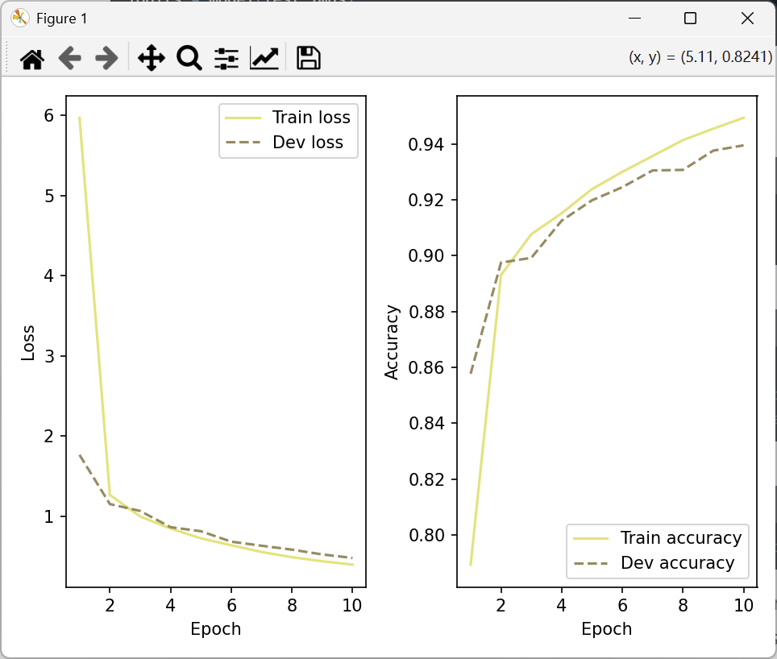
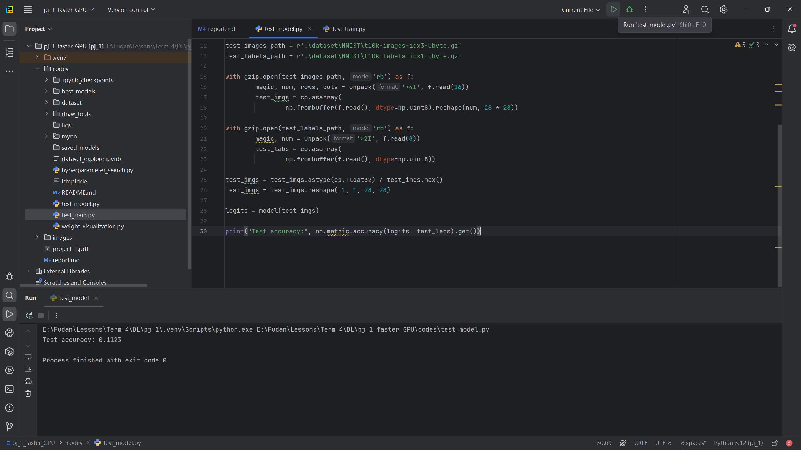

### CNN Model For Handwriting Digit Recognition

*Github (Model & Data):*

#### Implementation Interpretation

##### Layers

> ***Basic Structure***
> 
> ```python
> class Layer():
>     def __init__(self) -> None:
>         self.optimizable = True
>   
>     def __call__(self, X) -> np.ndarray
>         return self.forward(X)
>   
>     @abstractmethod
>     def forward():
>         
>
>     @abstractmethod
>     def backward():
>         pass
> ```
 

###### Linear Layer

$$
J(\mathbf{\beta}) = \frac{1}{2n}\sum_{i=1}^n (y_i - \hat{y}_i)^2 = \frac{1}{2n}\|\mathbf{y} - \mathbf{X}{\beta}\|^2
$$

```python
class Linear(Layer):
    def __init__(self, in_dim, out_dim, initialize_method=cp.random.normal,
                 weight_decay=False, weight_decay_lambda=1e-8):
        super().__init__()
        self.W = initialize_method(size=(in_dim, out_dim))
        self.b = initialize_method(size=(1, out_dim))
        self.grads = {'W': None, 'b': None}
        self.input = None
        self.params = {'W': self.W, 'b': self.b}
        self.weight_decay = weight_decay
        self.weight_decay_lambda = weight_decay_lambda

    def __call__(self, X) -> cp.ndarray:
        return self.forward(X)

    def forward(self, X):
        self.input = X
        return cp.dot(X, self.W) + self.b

    def backward(self, grad):
        self.grads['W'] = cp.dot(self.input.T, grad)
        self.grads['b'] = cp.sum(grad, axis=0)
        if self.weight_decay:
            self.grads['W'] += self.weight_decay_lambda * self.W
        return cp.dot(grad, self.W.T)

    def clear_grad(self):
        self.grads = {'W': None, 'b': None}
```

###### Flatten Layer

Literally convert X to 2D then restore.

```python
class Flatten(Layer):
    def __init__(self):
        super().__init__()
        self.optimizable = False
        self.input_shape = None

    def __call__(self, X):
        return self.forward(X)

    def forward(self, X):
        self.input_shape = X.shape
        return X.reshape(X.shape[0], -1)

    def backward(self, grads):
        return grads.reshape(self.input_shape)
```

###### Conv2D

$$
\mathbf{Y}_{i,j} = \sum_{m,n} \mathbf{W}_{m,n} \cdot \mathbf{X}_{s \cdot i+m - p, s \cdot j+n - p} + \mathbf{b}
$$

```python
class conv2D(Layer):
    def __init__(self, in_channels, out_channels, kernel_size, stride=1, padding=0,
                 initialize_method=None, weight_decay=False, weight_decay_lambda=1e-8):
        super().__init__()
        self.in_channels = in_channels
        self.out_channels = out_channels
        self.kernel_size = kernel_size
        self.stride = stride
        self.padding = padding
        if initialize_method is None:
            std = cp.sqrt(2. / (in_channels * kernel_size ** 2))
            initialize_method = lambda size: cp.random.normal(0, std, size)
        self.W = initialize_method(size=(out_channels, in_channels, kernel_size, kernel_size))
        self.b = initialize_method(size=(1, out_channels, 1, 1))
        self.grads = {'W': None, 'b': None}
        self.params = {'W': self.W, 'b': self.b}
        self.weight_decay = weight_decay
        self.weight_decay_lambda = weight_decay_lambda
        self.X_padded = None
        self.patches_reshaped = None

    def __call__(self, X) -> cp.ndarray:
        return self.forward(X)

    def forward(self, X):
        batch_size, in_channels, H, W = X.shape
        H_out = (H + 2 * self.padding - self.kernel_size) // self.stride + 1
        W_out = (W + 2 * self.padding - self.kernel_size) // self.stride + 1

        self.X_padded = cp.pad(X, ((0, 0), (0, 0),  # Add this line
                                   (self.padding, self.padding),
                                   (self.padding, self.padding)), mode='constant')

        batch_stride, channel_stride, h_stride, w_stride = self.X_padded.strides
        patches = as_strided(
            self.X_padded,
            shape=(batch_size, self.in_channels, H_out, W_out,
                   self.kernel_size, self.kernel_size),
            strides=(batch_stride, channel_stride,
                     h_stride * self.stride,
                     w_stride * self.stride,
                     h_stride, w_stride)
        )

        self.patches_reshaped = patches.transpose(0, 2, 3, 1, 4, 5).reshape(-1,
                                                                            self.in_channels * self.kernel_size ** 2)
        W_reshaped = self.W.reshape(self.out_channels, -1)
        output = cp.dot(self.patches_reshaped, W_reshaped.T).reshape(batch_size,
                                                                     H_out, W_out, self.out_channels)
        return output.transpose(0, 3, 1, 2) + self.b

    def backward(self, grads):
        batch_size, out_channels, H_out, W_out = grads.shape
        in_channels = self.in_channels
        kernel_size = self.kernel_size
        stride = self.stride
        padding = self.padding

        dout_reshaped = grads.transpose(0, 2, 3, 1).reshape(-1, out_channels)
        dW = cp.dot(dout_reshaped.T, self.patches_reshaped).reshape(self.W.shape)
        db = cp.sum(grads, axis=(0, 2, 3)).reshape(1, out_channels, 1, 1)

        W_reshaped = self.W.reshape(out_channels, -1)
        col_grad = cp.dot(dout_reshaped, W_reshaped)
        col_grad_reshaped = col_grad.reshape(batch_size, H_out, W_out, in_channels, kernel_size, kernel_size)

        dX_padded = cp.zeros_like(self.X_padded)
        batch_stride, channel_stride, h_stride, w_stride = dX_padded.strides
        patches_dX = as_strided(
            dX_padded,
            shape=(batch_size, in_channels, H_out, W_out, kernel_size, kernel_size),
            strides=(
                batch_stride,
                channel_stride,
                h_stride * stride,
                w_stride * stride,
                h_stride,
                w_stride
            )
        )

        col_grad_reshaped = col_grad_reshaped.transpose(0, 3, 1, 2, 4, 5)
        patches_dX += col_grad_reshaped

        if padding == 0:
            dX = dX_padded
        else:
            dX = dX_padded[:, :, padding:-padding, padding:-padding]

        if self.weight_decay:
            dW += self.weight_decay_lambda * self.W

        self.grads['W'] = dW
        self.grads['b'] = db
        return dX

    def clear_grad(self):
        self.grads = {'W': None, 'b': None}
        self.X_padded = None
        self.patches_reshaped = None
```

##### Loss Function

MultiClass Cross Entropy:

$$
L_i = -\log \left( \frac{e^{z_{y_i}}}{\sum_{j=1}^C e^{z_j}} \right) = -z_{y_i} + \log \left( \sum_{j=1}^C e^{z_j} \right)
$$

```python
class MultiCrossEntropyLoss(Layer):
    def __init__(self, model=None, max_classes=10):
        self.model = model
        self.has_softmax = True

    def __call__(self, predicts, labels):
        return self.forward(predicts, labels)

    def forward(self, predicts, labels):
        self.predicts = predicts
        self.labels = labels
        max_logit = cp.max(predicts, axis=1, keepdims=True)
        shifted_logits = predicts - max_logit
        exp_shifted = cp.exp(shifted_logits)
        sum_exp = cp.sum(exp_shifted, axis=1, keepdims=True)
        log_probs = shifted_logits - cp.log(sum_exp)
        true_log_probs = log_probs[cp.arange(len(labels)), labels]
        loss = -cp.mean(true_log_probs)
        return loss

    def backward(self):
        batch_size = self.predicts.shape[0]
        max_logit = cp.max(self.predicts, axis=1, keepdims=True)
        shifted_logits = self.predicts - max_logit
        exp_shifted = cp.exp(shifted_logits)
        sum_exp = cp.sum(exp_shifted, axis=1, keepdims=True)
        softmax_output = exp_shifted / sum_exp
        y_true = cp.zeros_like(softmax_output)
        y_true[cp.arange(batch_size), self.labels] = 1
        self.grads = (softmax_output - y_true) / batch_size
        self.model.backward(self.grads)
        return self.grads
```

##### Model

The model structure as shown following:

| Layer Type      | Parameters Shape         |
|-----------------|--------------------------|
| conv2D          | (16, 1, 3, 3)            |
| ReLU            | -                        |
| MaxPool2D       | -                        |
| conv2D          | (32, 16, 3, 3)           |
| ReLU            | -                        |
| MaxPool2D       | -                        |
| Flatten         | -                        |
| Linear          | (64, 1568)               |
| ReLU            | -                        |
| Linear          | (10, 64)                 |

```python
class Model_CNN(Layer):
    def __init__(self):
        super().__init__()
        self.layers = [
            conv2D(in_channels=1, out_channels=16, kernel_size=3, padding=1, stride=1),
            ReLU(),
            MaxPool2D(kernel_size=2),
            conv2D(in_channels=16, out_channels=32, kernel_size=3, padding=1, stride=1),
            ReLU(),
            MaxPool2D(kernel_size=2),
            Flatten(),
            Linear(in_dim=32 * 7 * 7, out_dim=64),
            ReLU(),
            Linear(in_dim=64, out_dim=10)
        ]

    def __call__(self, X):
        return self.forward(X)

    def forward(self, X):
        for layer in self.layers:
            X = layer(X)
        return X

    def backward(self, loss_grad):
        grads = loss_grad
        for layer in reversed(self.layers):
            grads = layer.backward(grads)
        return grads

    def save_model(self, save_path):
        param_list = []
        for layer in self.layers:
            if hasattr(layer, 'params'):
                param_list.append(layer.params)
        with open(save_path, 'wb') as f:
            pickle.dump(param_list, f)

    def load_model(self, param_list):
        idx = 0
        for layer in self.layers:
            if hasattr(layer, 'params'):
                layer.params = param_list[idx]
                idx += 1
```

##### Regulator

L2 Regularization: regularize parameters to the same scale to avoid overfitting.

```python
class L2Regularization(Layer):
    def __init__(self, model, weight_decay_lambda=1e-4):
        super().__init__()
        self.model = model
        self.weight_decay_lambda = weight_decay_lambda

    def forward(self, X):
        l2_loss = 0.0
        for layer in self.model.layers:
            if hasattr(layer, 'W'):
                l2_loss += 0.5 * self.weight_decay_lambda * cp.sum(layer.W ** 2)
        return l2_loss

    def backward(self):
        for layer in self.model.layers:
            if hasattr(layer, 'W'):
                layer.grads['W'] += self.weight_decay_lambda * layer.W
```

##### Optimizer

MomentGD: Improved From Momentum (See <a id="ADAM">ADAM</a>)

```python
class MomentGD(Optimizer):
    def __init__(self, init_lr, model, mu=0.9):
        super().__init__(init_lr, model)
        self.mu = mu
        self.velocities = {}
        for layer in model.layers:
            if layer.optimizable:
                self.velocities[id(layer)] = {key: cp.zeros_like(param) for key, param in layer.params.items()}

    def step(self):
        for layer in self.model.layers:
            if layer.optimizable:
                for key in layer.params:
                    v = self.velocities[id(layer)][key]
                    v = self.mu * v - self.init_lr * layer.grads[key]
                    layer.params[key] += v
                    self.velocities[id(layer)][key] = v
```

##### Scheduler

MultiStep Scheduler: lr multiples gamma (0.5) when hitting milestones (800, 1600, 2400)

```python
class MultiStepLR(scheduler):
    def __init__(self, optimizer, milestones, gamma=0.1):
        super().__init__(optimizer)
        self.milestones = milestones
        self.gamma = gamma

    def step(self):
        self.step_count += 1
        if self.step_count in self.milestones:
            self.optimizer.init_lr *= self.gamma
```

#### Attempts

###### MaxPooling2D

Extract feature maps to reduce dimension for faster computation. 

$$
\mathbf{Y}_{i,j} = \max_{m \in [0, k_h), \, n \in [0, k_w)} \mathbf{X}_{s \cdot i + m, \, s \cdot j + n}
$$
$$
\frac{\partial L}{\partial \mathbf{X}_{p,q}} = 
\begin{cases} 
\frac{\partial L}{\partial \mathbf{Y}_{i,j}} & \text{if } \mathbf{X}_{p,q} \text{ was the max in window } (i,j) \\
0 & \text{otherwise}
\end{cases}
$$

```python
class MaxPool2D(Layer):
    def __init__(self, kernel_size=2):
        super().__init__()
        self.kernel_size = kernel_size
        self.optimizable = False

    def __call__(self, X) -> cp.ndarray:
        return self.forward(X)

    def forward(self, X):
        N, C, H, W = X.shape
        self.X = X
        H_out = H // self.kernel_size
        W_out = W // self.kernel_size
        X_reshaped = X.reshape(N, C, H_out, self.kernel_size, W_out, self.kernel_size)
        return X_reshaped.max(axis=(3, 5))

    def backward(self, grad):
        N, C, H_out, W_out = grad.shape
        grad_reshaped = grad.repeat(self.kernel_size, axis=2).repeat(self.kernel_size, axis=3)
        X_reshaped = self.X.reshape(N, C, H_out, self.kernel_size, W_out, self.kernel_size)
        mask = (X_reshaped == X_reshaped.max(axis=(3, 5), keepdims=True))
        return grad_reshaped * mask.reshape(N, C, H_out * self.kernel_size, W_out * self.kernel_size)
```

##### [ADAM (Adaptive Moment Estimation)](#ADAM)

Momentum and RMSprop Combined:
$$
   \mathbf{m}_t \leftarrow \beta_1 \mathbf{m}_{t-1} + (1 - \beta_1) \mathbf{g}_t
$$
$$
   \mathbf{v}_t \leftarrow \beta_2 \mathbf{v}_{t-1} + (1 - \beta_2) \mathbf{g}_t^2
$$
$$
   \theta_t \leftarrow \theta_{t-1} - \alpha \frac{\hat{\mathbf{m}}_t}{\sqrt{\hat{\mathbf{v}}_t} + \epsilon}
$$

```python
class Adam(Optimizer):
    def __init__(self, init_lr, model, beta1=0.9, beta2=0.999, epsilon=1e-8):
        super().__init__(init_lr, model)
        self.beta1 = beta1
        self.beta2 = beta2
        self.epsilon = epsilon
        self.m = {}
        self.v = {}
        self.t = 0

        for layer in model.layers:
            if layer.optimizable:
                self.m[id(layer)] = {key: cp.zeros_like(param) for key, param in layer.params.items()}
                self.v[id(layer)] = {key: cp.zeros_like(param) for key, param in layer.params.items()}

    def step(self):
        self.t += 1
        for layer in self.model.layers:
            if layer.optimizable:
                for key in layer.params:
                    g = layer.grads[key]
                    self.m[id(layer)][key] = self.beta1 * self.m[id(layer)][key] + (1 - self.beta1) * g
                    self.v[id(layer)][key] = self.beta2 * self.v[id(layer)][key] + (1 - self.beta2) * g ** 2
                    m_hat = self.m[id(layer)][key] / (1 - self.beta1 ** self.t)
                    v_hat = self.v[id(layer)][key] / (1 - self.beta2 ** self.t)
                    layer.params[key] -= self.init_lr * m_hat / (cp.sqrt(v_hat) + self.epsilon)
```

##### Apply CuPy For GPU Acceleration (See <a id="Codes">Codes</a>)

#### [Codes](#Codes)

##### op.py

```python
from abc import abstractmethod
import cupy as cp
from cupy.lib.stride_tricks import as_strided


class Layer():
    def __init__(self) -> None:
        self.optimizable = True

    @abstractmethod
    def forward(self):
        pass

    @abstractmethod
    def backward(self):
        pass


class Linear(Layer):
    def __init__(self, in_dim, out_dim, initialize_method=cp.random.normal,
                 weight_decay=False, weight_decay_lambda=1e-8):
        super().__init__()
        self.W = initialize_method(size=(in_dim, out_dim))
        self.b = initialize_method(size=(1, out_dim))
        self.grads = {'W': None, 'b': None}
        self.input = None
        self.params = {'W': self.W, 'b': self.b}
        self.weight_decay = weight_decay
        self.weight_decay_lambda = weight_decay_lambda

    def __call__(self, X) -> cp.ndarray:
        return self.forward(X)

    def forward(self, X):
        self.input = X
        return cp.dot(X, self.W) + self.b

    def backward(self, grad):
        self.grads['W'] = cp.dot(self.input.T, grad)
        self.grads['b'] = cp.sum(grad, axis=0)
        if self.weight_decay:
            self.grads['W'] += self.weight_decay_lambda * self.W
        return cp.dot(grad, self.W.T)

    def clear_grad(self):
        self.grads = {'W': None, 'b': None}


class Flatten(Layer):
    def __init__(self):
        super().__init__()
        self.optimizable = False
        self.input_shape = None

    def __call__(self, X):
        return self.forward(X)

    def forward(self, X):
        self.input_shape = X.shape
        return X.reshape(X.shape[0], -1)

    def backward(self, grads):
        return grads.reshape(self.input_shape)


class conv2D(Layer):
    def __init__(self, in_channels, out_channels, kernel_size, stride=1, padding=0,
                 initialize_method=None, weight_decay=False, weight_decay_lambda=1e-8):
        super().__init__()
        self.in_channels = in_channels
        self.out_channels = out_channels
        self.kernel_size = kernel_size
        self.stride = stride
        self.padding = padding
        if initialize_method is None:
            std = cp.sqrt(2. / (in_channels * kernel_size ** 2))
            initialize_method = lambda size: cp.random.normal(0, std, size)
        self.W = initialize_method(size=(out_channels, in_channels, kernel_size, kernel_size))
        self.b = initialize_method(size=(1, out_channels, 1, 1))
        self.grads = {'W': None, 'b': None}
        self.params = {'W': self.W, 'b': self.b}
        self.weight_decay = weight_decay
        self.weight_decay_lambda = weight_decay_lambda
        self.X_padded = None
        self.patches_reshaped = None

    def __call__(self, X) -> cp.ndarray:
        return self.forward(X)

    def forward(self, X):
        batch_size, in_channels, H, W = X.shape
        H_out = (H + 2 * self.padding - self.kernel_size) // self.stride + 1
        W_out = (W + 2 * self.padding - self.kernel_size) // self.stride + 1

        self.X_padded = cp.pad(X, ((0, 0), (0, 0),  # Add this line
                                   (self.padding, self.padding),
                                   (self.padding, self.padding)), mode='constant')

        batch_stride, channel_stride, h_stride, w_stride = self.X_padded.strides
        patches = as_strided(
            self.X_padded,
            shape=(batch_size, self.in_channels, H_out, W_out,
                   self.kernel_size, self.kernel_size),
            strides=(batch_stride, channel_stride,
                     h_stride * self.stride,
                     w_stride * self.stride,
                     h_stride, w_stride)
        )

        self.patches_reshaped = patches.transpose(0, 2, 3, 1, 4, 5).reshape(-1,
                                                                            self.in_channels * self.kernel_size ** 2)
        W_reshaped = self.W.reshape(self.out_channels, -1)
        output = cp.dot(self.patches_reshaped, W_reshaped.T).reshape(batch_size,
                                                                     H_out, W_out, self.out_channels)
        return output.transpose(0, 3, 1, 2) + self.b

    def backward(self, grads):
        batch_size, out_channels, H_out, W_out = grads.shape
        in_channels = self.in_channels
        kernel_size = self.kernel_size
        stride = self.stride
        padding = self.padding

        dout_reshaped = grads.transpose(0, 2, 3, 1).reshape(-1, out_channels)
        dW = cp.dot(dout_reshaped.T, self.patches_reshaped).reshape(self.W.shape)
        db = cp.sum(grads, axis=(0, 2, 3)).reshape(1, out_channels, 1, 1)

        W_reshaped = self.W.reshape(out_channels, -1)
        col_grad = cp.dot(dout_reshaped, W_reshaped)
        col_grad_reshaped = col_grad.reshape(batch_size, H_out, W_out, in_channels, kernel_size, kernel_size)

        dX_padded = cp.zeros_like(self.X_padded)
        batch_stride, channel_stride, h_stride, w_stride = dX_padded.strides
        patches_dX = as_strided(
            dX_padded,
            shape=(batch_size, in_channels, H_out, W_out, kernel_size, kernel_size),
            strides=(
                batch_stride,
                channel_stride,
                h_stride * stride,
                w_stride * stride,
                h_stride,
                w_stride
            )
        )

        col_grad_reshaped = col_grad_reshaped.transpose(0, 3, 1, 2, 4, 5)
        patches_dX += col_grad_reshaped

        if padding == 0:
            dX = dX_padded
        else:
            dX = dX_padded[:, :, padding:-padding, padding:-padding]

        if self.weight_decay:
            dW += self.weight_decay_lambda * self.W

        self.grads['W'] = dW
        self.grads['b'] = db
        return dX

    def clear_grad(self):
        self.grads = {'W': None, 'b': None}
        self.X_padded = None
        self.patches_reshaped = None


class ReLU(Layer):
    def __init__(self) -> None:
        super().__init__()
        self.input = None
        self.optimizable = False

    def __call__(self, X):
        return self.forward(X)

    def forward(self, X):
        self.input = X
        return cp.where(X < 0, 0, X)

    def backward(self, grads):
        return cp.where(self.input < 0, 0, grads)


class MaxPool2D(Layer):
    def __init__(self, kernel_size=2):
        super().__init__()
        self.kernel_size = kernel_size
        self.optimizable = False

    def __call__(self, X) -> cp.ndarray:
        return self.forward(X)

    def forward(self, X):
        N, C, H, W = X.shape
        self.X = X
        H_out = H // self.kernel_size
        W_out = W // self.kernel_size
        X_reshaped = X.reshape(N, C, H_out, self.kernel_size, W_out, self.kernel_size)
        return X_reshaped.max(axis=(3, 5))

    def backward(self, grad):
        N, C, H_out, W_out = grad.shape
        grad_reshaped = grad.repeat(self.kernel_size, axis=2).repeat(self.kernel_size, axis=3)
        X_reshaped = self.X.reshape(N, C, H_out, self.kernel_size, W_out, self.kernel_size)
        mask = (X_reshaped == X_reshaped.max(axis=(3, 5), keepdims=True))
        return grad_reshaped * mask.reshape(N, C, H_out * self.kernel_size, W_out * self.kernel_size)


class MultiCrossEntropyLoss(Layer):
    def __init__(self, model=None, max_classes=10):
        self.model = model
        self.has_softmax = True

    def __call__(self, predicts, labels):
        return self.forward(predicts, labels)

    def forward(self, predicts, labels):
        self.predicts = predicts
        self.labels = labels
        max_logit = cp.max(predicts, axis=1, keepdims=True)
        shifted_logits = predicts - max_logit
        exp_shifted = cp.exp(shifted_logits)
        sum_exp = cp.sum(exp_shifted, axis=1, keepdims=True)
        log_probs = shifted_logits - cp.log(sum_exp)
        true_log_probs = log_probs[cp.arange(len(labels)), labels]
        loss = -cp.mean(true_log_probs)
        return loss

    def backward(self):
        batch_size = self.predicts.shape[0]
        max_logit = cp.max(self.predicts, axis=1, keepdims=True)
        shifted_logits = self.predicts - max_logit
        exp_shifted = cp.exp(shifted_logits)
        sum_exp = cp.sum(exp_shifted, axis=1, keepdims=True)
        softmax_output = exp_shifted / sum_exp
        y_true = cp.zeros_like(softmax_output)
        y_true[cp.arange(batch_size), self.labels] = 1
        self.grads = (softmax_output - y_true) / batch_size
        self.model.backward(self.grads)
        return self.grads


class L2Regularization(Layer):
    def __init__(self, model, weight_decay_lambda=1e-4):
        super().__init__()
        self.model = model
        self.weight_decay_lambda = weight_decay_lambda

    def forward(self, X):
        l2_loss = 0.0
        for layer in self.model.layers:
            if hasattr(layer, 'W'):
                l2_loss += 0.5 * self.weight_decay_lambda * cp.sum(layer.W ** 2)
        return l2_loss

    def backward(self):
        for layer in self.model.layers:
            if hasattr(layer, 'W'):
                layer.grads['W'] += self.weight_decay_lambda * layer.W


def softmax(X):
    x_max = cp.max(X, axis=1, keepdims=True)
    x_exp = cp.exp(X - x_max)
    partition = cp.sum(x_exp, axis=1, keepdims=True)
    return x_exp / partition
```

##### model.py

```python
from .op import *
import pickle

class Model_MLP(Layer):
    """
    A model with linear layers. We provied you with this example about a structure of a model.
    """
    def __init__(self, size_list=None, act_func=None, lambda_list=None):
        self.size_list = size_list
        self.act_func = act_func

        if size_list is not None and act_func is not None:
            self.layers = []
            for i in range(len(size_list) - 1):
                layer = Linear(in_dim=size_list[i], out_dim=size_list[i + 1])
                if lambda_list is not None:
                    layer.weight_decay = True
                    layer.weight_decay_lambda = lambda_list[i]
                if act_func == 'Logistic':
                    raise NotImplementedError
                elif act_func == 'ReLU':
                    layer_f = ReLU()
                self.layers.append(layer)
                if i < len(size_list) - 2:
                    self.layers.append(layer_f)

    def __call__(self, X):
        return self.forward(X)

    def forward(self, X):
        assert self.size_list is not None and self.act_func is not None, 'Model has not initialized yet. Use model.load_model to load a model or create a new model with size_list and act_func offered.'
        outputs = X
        for layer in self.layers:
            outputs = layer(outputs)
        return outputs

    def backward(self, loss_grad):
        grads = loss_grad
        for layer in reversed(self.layers):
            grads = layer.backward(grads)
        return grads

    def load_model(self, param_list):
        with open(param_list, 'rb') as f:
            param_list = pickle.load(f)
        self.size_list = param_list[0]
        self.act_func = param_list[1]

        for i in range(len(self.size_list) - 1):
            self.layers = []
            for i in range(len(self.size_list) - 1):
                layer = Linear(in_dim=self.size_list[i], out_dim=self.size_list[i + 1])
                layer.W = param_list[i + 2]['W']
                layer.b = param_list[i + 2]['b']
                layer.params['W'] = layer.W
                layer.params['b'] = layer.b
                layer.weight_decay = param_list[i + 2]['weight_decay']
                layer.weight_decay_lambda = param_list[i+2]['lambda']
                if self.act_func == 'Logistic':
                    raise NotImplemented
                elif self.act_func == 'ReLU':
                    layer_f = ReLU()
                self.layers.append(layer)
                if i < len(self.size_list) - 2:
                    self.layers.append(layer_f)
        
    def save_model(self, save_path):
        param_list = [self.size_list, self.act_func]
        for layer in self.layers:
            if layer.optimizable:
                param_list.append({'W' : layer.params['W'], 'b' : layer.params['b'], 'weight_decay' : layer.weight_decay, 'lambda' : layer.weight_decay_lambda})
        
        with open(save_path, 'wb') as f:
            pickle.dump(param_list, f)
        

class Model_CNN(Layer):
    def __init__(self):
        super().__init__()
        self.layers = [
            conv2D(in_channels=1, out_channels=16, kernel_size=3, padding=1, stride=1),
            ReLU(),
            MaxPool2D(kernel_size=2),
            conv2D(in_channels=16, out_channels=32, kernel_size=3, padding=1, stride=1),
            ReLU(),
            MaxPool2D(kernel_size=2),
            Flatten(),
            Linear(in_dim=32 * 7 * 7, out_dim=64),
            ReLU(),
            Linear(in_dim=64, out_dim=10)
        ]

    def __call__(self, X):
        return self.forward(X)

    def forward(self, X):
        for layer in self.layers:
            X = layer(X)
        return X

    def backward(self, loss_grad):
        grads = loss_grad
        for layer in reversed(self.layers):
            grads = layer.backward(grads)
        return grads

    def save_model(self, save_path):
        param_list = []
        for layer in self.layers:
            if hasattr(layer, 'params'):
                param_list.append(layer.params)
        with open(save_path, 'wb') as f:
            pickle.dump(param_list, f)

    def load_model(self, param_list):
        idx = 0
        for layer in self.layers:
            if hasattr(layer, 'params'):
                layer.params = param_list[idx]
                idx += 1
```

##### optimizer.py

```python
from abc import abstractmethod
import cupy as cp


class Optimizer:
    def __init__(self, init_lr, model) -> None:
        self.init_lr = init_lr
        self.model = model

    @abstractmethod
    def step(self):
        pass


class SGD(Optimizer):
    def __init__(self, init_lr, model):
        super().__init__(init_lr, model)

    def step(self):
        for layer in self.model.layers:
            if layer.optimizable:
                for key in layer.params.keys():
                    if layer.weight_decay:
                        layer.params[key] *= (1 - self.init_lr * layer.weight_decay_lambda)
                    layer.params[key] -= self.init_lr * layer.grads[key]


class MomentGD(Optimizer):
    def __init__(self, init_lr, model, mu=0.9):
        super().__init__(init_lr, model)
        self.mu = mu
        self.velocities = {}
        for layer in model.layers:
            if layer.optimizable:
                self.velocities[id(layer)] = {key: cp.zeros_like(param) for key, param in layer.params.items()}

    def step(self):
        for layer in self.model.layers:
            if layer.optimizable:
                for key in layer.params:
                    v = self.velocities[id(layer)][key]
                    v = self.mu * v - self.init_lr * layer.grads[key]
                    layer.params[key] += v
                    self.velocities[id(layer)][key] = v


class Adam(Optimizer):
    def __init__(self, init_lr, model, beta1=0.9, beta2=0.999, epsilon=1e-8):
        super().__init__(init_lr, model)
        self.beta1 = beta1
        self.beta2 = beta2
        self.epsilon = epsilon
        self.m = {}
        self.v = {}
        self.t = 0

        for layer in model.layers:
            if layer.optimizable:
                self.m[id(layer)] = {key: cp.zeros_like(param) for key, param in layer.params.items()}
                self.v[id(layer)] = {key: cp.zeros_like(param) for key, param in layer.params.items()}

    def step(self):
        self.t += 1
        for layer in self.model.layers:
            if layer.optimizable:
                for key in layer.params:
                    g = layer.grads[key]
                    self.m[id(layer)][key] = self.beta1 * self.m[id(layer)][key] + (1 - self.beta1) * g
                    self.v[id(layer)][key] = self.beta2 * self.v[id(layer)][key] + (1 - self.beta2) * g ** 2
                    m_hat = self.m[id(layer)][key] / (1 - self.beta1 ** self.t)
                    v_hat = self.v[id(layer)][key] / (1 - self.beta2 ** self.t)
                    layer.params[key] -= self.init_lr * m_hat / (cp.sqrt(v_hat) + self.epsilon)
```

##### lr_scheduler.py

```python
from abc import abstractmethod
import numpy as np

class scheduler():
    def __init__(self, optimizer) -> None:
        self.optimizer = optimizer
        self.step_count = 0
    
    @abstractmethod
    def step():
        pass


class StepLR(scheduler):
    def __init__(self, optimizer, step_size=30, gamma=0.1) -> None:
        super().__init__(optimizer)
        self.step_size = step_size
        self.gamma = gamma

    def step(self) -> None:
        self.step_count += 1
        if self.step_count >= self.step_size:
            self.optimizer.init_lr *= self.gamma
            self.step_count = 0

class MultiStepLR(scheduler):
    def __init__(self, optimizer, milestones, gamma=0.1):
        super().__init__(optimizer)
        self.milestones = milestones
        self.gamma = gamma

    def step(self):
        self.step_count += 1
        if self.step_count in self.milestones:
            self.optimizer.init_lr *= self.gamma

class ExponentialLR(scheduler):
    def __init__(self, optimizer, gamma=0.1):
        super().__init__(optimizer)
        self.gamma = gamma

    def step(self):
        self.step_count += 1
        self.optimizer.init_lr *= self.gamma
```

##### runner.py

```python
import cupy as cp
import os
from tqdm import tqdm

class RunnerM:
    def __init__(self, model, optimizer, metric, loss_fn, batch_size=32, scheduler=None, l2_reg=None):
        self.model = model
        self.optimizer = optimizer
        self.loss_fn = loss_fn
        self.metric = metric
        self.scheduler = scheduler
        self.batch_size = batch_size
        self.l2_reg = l2_reg

        self.train_scores = []
        self.dev_scores = []
        self.train_loss = []
        self.dev_loss = []

    def train(self, train_set, dev_set, **kwargs):
        num_epochs = kwargs.get("num_epochs", 0)
        log_iters = kwargs.get("log_iters", 100)
        save_dir = kwargs.get("save_dir", "best_model")
        X, y = train_set

        self.train_scores = []
        self.dev_scores = []
        self.train_loss = []
        self.dev_loss = []

        self.best_score = 0

        for epoch in range(num_epochs):
            idx = cp.random.permutation(len(X))
            X, y = X[idx], y[idx]

            epoch_train_loss = 0.0
            epoch_train_score = 0.0
            batch_count = 0


            for iteration in range(0, len(X), self.batch_size):
                train_X = X[iteration:iteration+self.batch_size]
                train_y = y[iteration:iteration+self.batch_size]

                if len(train_X.shape) == 2:
                    train_X = train_X.reshape(-1, 1, 28, 28)
                logits = self.model(train_X)
                trn_loss = self.loss_fn(logits, train_y)
                if self.l2_reg:
                    trn_loss += self.l2_reg.forward(logits)
                trn_score = self.metric(logits, train_y)
                self.loss_fn.backward()
                if self.l2_reg:
                    self.l2_reg.backward()
                self.optimizer.step()
                if self.scheduler:
                    self.scheduler.step()

                epoch_train_loss += trn_loss.item()
                epoch_train_score += trn_score.item()
                batch_count += 1

                if (iteration) % log_iters == 0:
                    print(f"epoch: {epoch}, iteration: {iteration}")
                    print(f"[Train] loss: {trn_loss}, score: {trn_score}")

            self.train_loss.append(epoch_train_loss / batch_count)
            self.train_scores.append(epoch_train_score / batch_count)

            dev_score, dev_loss = self.evaluate(dev_set)
            self.dev_scores.append(dev_score)
            self.dev_loss.append(dev_loss)

            print(f"Epoch {epoch + 1}/{num_epochs}")
            print(f"[Train] loss: {self.train_loss[-1]:.4f}, score: {self.train_scores[-1]:.4f}")
            print(f"[Dev] loss: {self.dev_loss[-1]:.4f}, score: {self.dev_scores[-1]:.4f}\n")

            if dev_score > self.best_score:
                save_path = os.path.join(save_dir, 'best_model.pickle')
                self.save_model(save_path)
                print(f"best accuracy performence has been updated: {self.best_score:.5f} --> {dev_score:.5f}")
                self.best_score = dev_score

    def evaluate(self, data_set):
        X, y = data_set
        if len(X.shape) == 2:
            X = X.reshape(-1, 1, 28, 28)
        logits = self.model(X)
        loss = self.loss_fn(logits, y)
        score = self.metric(logits, y)
        return score.item(), loss.item()
    
    def save_model(self, save_path):
        self.model.save_model(save_path)
```

##### metric.py

```python
import cupy as cp

def accuracy(preds, labels):
    """
    Metric for MNIST.
    preds : [batch, D]
    labels : [batch, ]
    """
    assert preds.shape[0] == labels.shape[0]

    predict_label = cp.argmax(preds, axis=-1)
    return (predict_label == labels).sum() / preds.shape[0]

```

##### __init__py

```python
from mynn import op
from mynn import optimizer
from mynn import models
from mynn import lr_scheduler
from mynn import runner
from mynn import metric
```

##### ../test_train.py

```python
# An example of read in the data and train the model. The runner is implemented, while the model used for training need your implementation.
import mynn as nn
from draw_tools.plot import plot

import numpy as np
import cupy as cp
from struct import unpack
import gzip
import matplotlib.pyplot as plt
import pickle

np.random.seed(309)

train_images_path = r'.\dataset\MNIST\train-images-idx3-ubyte.gz'
train_labels_path = r'.\dataset\MNIST\train-labels-idx1-ubyte.gz'

with gzip.open(train_images_path, 'rb') as f:
        magic, num, rows, cols = unpack('>4I', f.read(16))
        train_imgs=np.frombuffer(f.read(), dtype=np.uint8).reshape(num, 28*28)
    
with gzip.open(train_labels_path, 'rb') as f:
        magic, num = unpack('>2I', f.read(8))
        train_labs = np.frombuffer(f.read(), dtype=np.uint8)


idx = np.random.permutation(np.arange(num))
with open('idx.pickle', 'wb') as f:
        pickle.dump(idx, f)
train_imgs = train_imgs[idx]
train_labs = train_labs[idx]
valid_imgs = train_imgs[:10000]
valid_labs = train_labs[:10000]
train_imgs = train_imgs[10000:]
train_labs = train_labs[10000:]

train_imgs = train_imgs / train_imgs.max()
valid_imgs = valid_imgs / valid_imgs.max()

train_imgs = cp.asarray(train_imgs)
train_labs = cp.asarray(train_labs)
valid_imgs = cp.asarray(valid_imgs)
valid_labs = cp.asarray(valid_labs)

cnn_model = nn.models.Model_CNN()
base_lr = 0.001
batch_size = 32
optimizer = nn.optimizer.Adam(init_lr=base_lr * (batch_size / 32), model=cnn_model)
scheduler = nn.lr_scheduler.MultiStepLR(optimizer=optimizer, milestones=[800, 1600, 2400], gamma=0.5)
loss_fn = nn.op.MultiCrossEntropyLoss(model=cnn_model, max_classes=train_labs.max()+1)

runner = nn.runner.RunnerM(cnn_model, optimizer, nn.metric.accuracy, loss_fn, scheduler=scheduler)

runner.train([train_imgs, train_labs], [valid_imgs, valid_labs], num_epochs=10, log_iters=100, save_dir=r'./best_models')


_, axes = plt.subplots(1, 2)
axes.reshape(-1)
_.set_tight_layout(1)
plot(runner, axes)

plt.show()
```

##### ../test_model.py

```python
import mynn as nn
import numpy as np
import cupy as cp
from struct import unpack
import gzip
import matplotlib.pyplot as plt
import pickle

model = nn.models.Model_CNN()
model.load_model(r'.\best_models\best_model.pickle')

test_images_path = r'.\dataset\MNIST\t10k-images-idx3-ubyte.gz'
test_labels_path = r'.\dataset\MNIST\t10k-labels-idx1-ubyte.gz'

with gzip.open(test_images_path, 'rb') as f:
        magic, num, rows, cols = unpack('>4I', f.read(16))
        test_imgs = cp.asarray(
                np.frombuffer(f.read(), dtype=np.uint8).reshape(num, 28 * 28))

with gzip.open(test_labels_path, 'rb') as f:
        magic, num = unpack('>2I', f.read(8))
        test_labs = cp.asarray(
                np.frombuffer(f.read(), dtype=np.uint8))

test_imgs = test_imgs.astype(cp.float32) / test_imgs.max()
test_imgs = test_imgs.reshape(-1, 1, 28, 28)

logits = model(test_imgs)

print("Test accuracy:", nn.metric.accuracy(logits, test_labs).get())
```

#### Result


